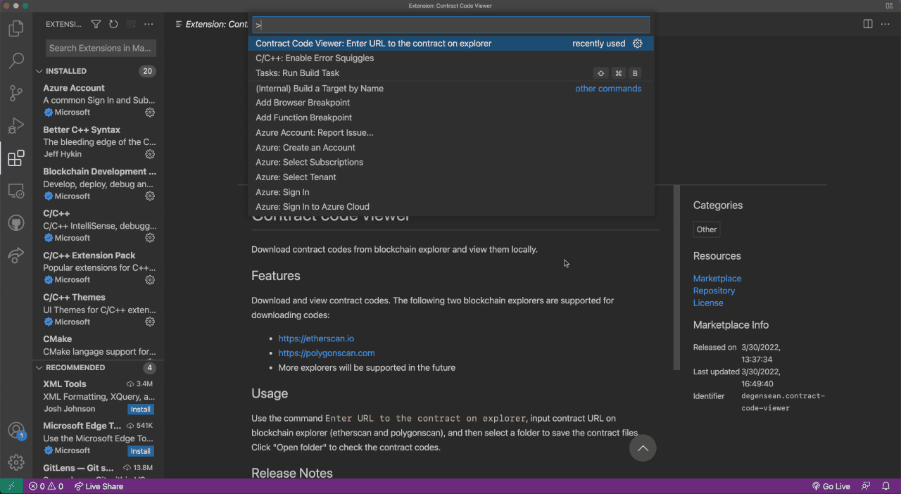

# Contract code viewer 

Download contract codes from blockchain explorer and view them locally.

## Features

Download and view contract codes. The following two blockchain explorers are supported for downloading codes:
- [https://etherscan.io](https://etherscan.io)
- [https://polygonscan.com](https://polygonscan.com)
- [https://bscscan.com](https://bscscan.com)
- [https://ftmscan.com](https://ftmscan.com)
- [https://snowtrace.io](https://snowtrace.io)

Let us know if you want more explorers become supported.

## Usage

Use the command `Contract Code Viewer: Enter URL to the contract on explorer`, input contract URL on blockchain explorer (etherscan and polygonscan), and then select a folder to save the contract files. Click "Open folder" to check the contract codes.

## Release Notes

## [1.1.4] - 2022-05-08

### Added
- The extension can now download contract code from [bscscan.com](https://bscscan.com), [ftmscan.com](https://ftmscan.com), and [snowtrace.io](https://snowtrace.io).

Please check [CHANGELOG.md](./CHANGELOG.md).

## Acknowledgement

Thank @DocRace for designing the icon.